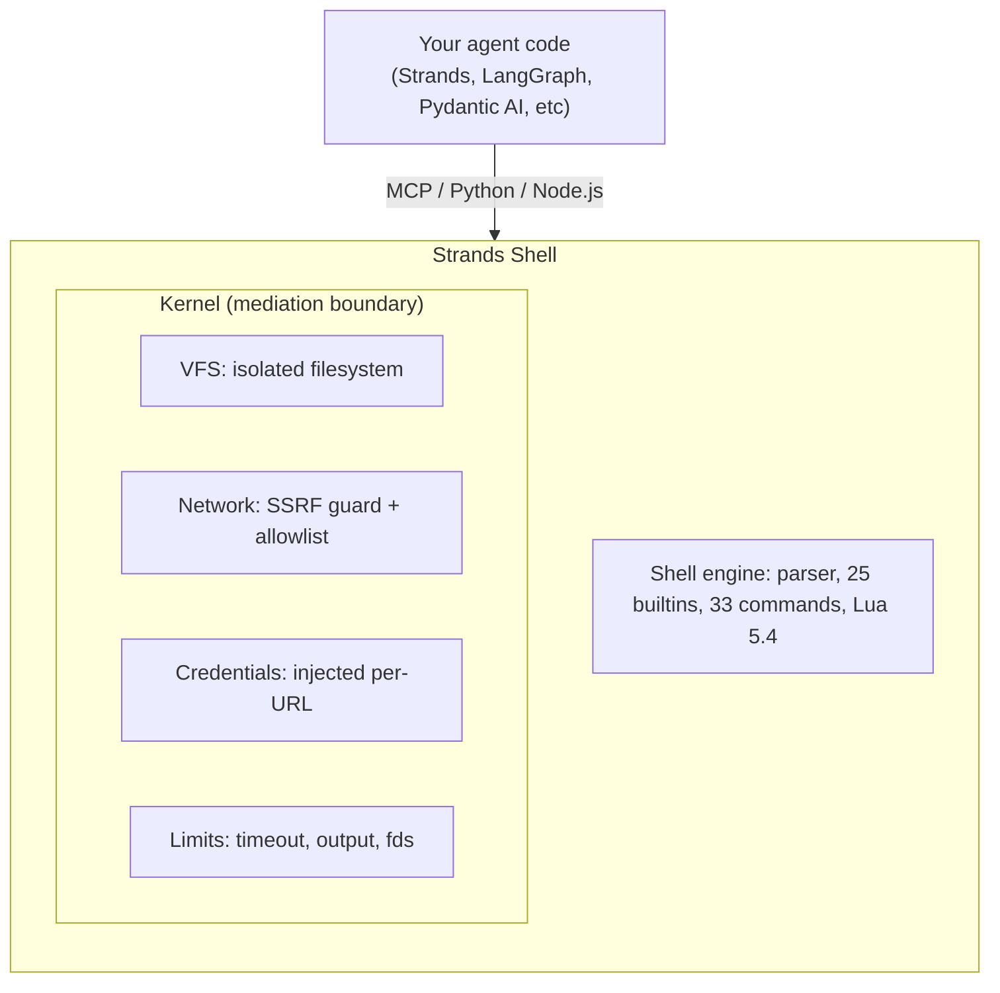

<div align="center">
  <div>
    <a href="https://strandsagents.com">
      
    </a>
  </div>

  <h1>
    Strands Shell
  </h1>

  <h2>
    Give your agent a shell without giving it the keys to your machine.
  </h2>

  <div align="center">
    <a href="https://pypi.org/project/strands-shell/"></a>
    <a href="https://www.npmjs.com/package/@strands-agents/shell"></a>
    <a href="#license"></a>
    <a href="https://discord.gg/strands"></a>
  </div>

  <p>
    <a href="https://strandsagents.com/docs/user-guide/shell/">Documentation</a>
    ◆ <a href="#mcp-server">MCP Server</a>
    ◆ <a href="#python">Python</a>
    ◆ <a href="#nodejs">Node.js</a>
  </p>
</div>

---

Agents run shell commands in tight loops: Install deps, run tests, grep for errors, iterate. Those loops need speed and isolation. 

Strands Shell is a Bourne-compatible shell that runs in-process. `grep`, `sed`, `jq`, `curl`, `find`, 50+ commands and it does this without fork, exec, syscalls, or cold starts. You declare what the agent can reach (files, URLs, credentials) and everything else doesn't exist to the agent.

| | Docker | Cloud sandbox | Strands Shell |
|---|---|---|---|
| **Cold start** | ~200ms | ~1s (network) | <1ms |
| **Isolation** | Container namespace | MicroVM | In-process VFS |
| **Network** | iptables / sidecar | Platform policy | URL allowlist + SSRF guard |
| **Secrets** | Env vars (agent can read them) | Platform-specific | Injected per-request, agent never sees them |
| **Setup** | Docker daemon | API key + network | `pip install strands-shell` |
| **Platforms** | Linux | Cloud-only | macOS, Linux, WASM |

## Quick Start

### MCP (works with any agent framework)

Drop this into your MCP client config:

```json
{
  "mcpServers": {
    "shell": {
      "command": "uvx",
      "args": ["strands-shell", "--mcp"]
    }
  }
}
```

That's it and your agent gets `shell`, `read_file`, `write_file`, `list_dir`. All mediated through the Kernel.

### Python

```bash
pip install strands-shell
```

```python
import strands_shell

shell = strands_shell.Shell(
    binds=[strands_shell.Bind("/my/project", "/workspace", mode="copy")],
    credentials=[strands_shell.Cred("https://api.example.com/", env_var="API_TOKEN")],
    allowed_urls=["https://api.example.com/"],
)

out = shell.run("grep -rn TODO /workspace")
print(out.stdout)
```

### Node.js

```bash
npm install @strands-agents/shell
```

```javascript
import { Shell } from '@strands-agents/shell'

const shell = await Shell.create({
  binds: [{ source: '/my/project', destination: '/workspace', mode: 'copy' }],
})
const out = await shell.run('grep -rn TODO /workspace')
console.log(out.stdout)
```

## How It Works



Written in Rust, with native bindings for Python (PyO3) and Node.js (napi-rs). State persists across `run()` calls (env vars, working directory, functions). The filesystem is shared.

## Configuration

```python
shell = strands_shell.Shell(
    binds=[
        strands_shell.Bind("/host/project", "/workspace", mode="copy"),
        strands_shell.Bind("/tmp/output", "/output", mode="direct"),
    ],
    credentials=[
        strands_shell.Cred("https://api.example.com/", env_var="API_TOKEN"),
    ],
    allowed_urls=["https://api.example.com/", "https://pypi.org/"],
    timeout=30.0,
    env={"PROJECT": "demo"},
    limits=strands_shell.Limits(
        max_output=1 << 20,
        max_file_size=10 << 20,
    ),
)
```

> ⚠️ **`mode: "direct"` mounts are live.** The agent can read and modify host files in real time. Use only for designated output directories. Never direct-bind directories containing secrets, credentials, or configuration you don't want the agent to modify.

### TOML

You can load all of this from a config file instead:

```toml
[[bind]]
mode = "copy"
source = "/host/project"
destination = "/workspace"

[[cred]]
url = "https://api.openai.com/v1/"
methods = ["POST"]
kind = "bearer"
api_key_env = "OPENAI_API_KEY"

[[mcp]]
name = "my-tools"
command = "/path/to/mcp-server"
args = ["--stdio"]
```

## MCP Server

The built-in [MCP](https://modelcontextprotocol.io/) server exposes the shell over JSON-RPC on stdio, working with anything that speaks MCP.

```sh
uvx strands-shell --mcp                          # bare in-memory sandbox
uvx strands-shell --config sandbox.toml --mcp    # with mounts + credentials
```

If you declare `[[mcp]]` servers in your TOML config, they show up as Lua modules inside the shell. Call `require("my_tools")` and you get a table of the server's tools.

## Security Model

> **Strands Shell is a mediation layer, not a security sandbox.** It enforces what the agent *should* access via Kernel-mediated deny-by-default. It does NOT protect against: memory-safety exploits in the shell engine itself, timing side-channels, or an attacker who controls the host process. For multi-tenant or adversarial workloads, run each Shell instance inside a container or microVM.

The Kernel mediates everything; it runs in the same process as your code, not in a VM. If your threat model is "untrusted tenant running arbitrary code," put Strands Shell inside a container too. For "my agent shouldn't access things I haven't explicitly allowed," the Kernel handles it.

**Default-deny. You allowlist what the agent can reach:**

- Files: only bound paths exist, everything else is hidden.
- Network: `curl` blocks private ranges (RFC1918, link-local, loopback, IMDS) by default while letting public URLs pass through. Use `allowed_urls` to permit specific internal hosts.
- Secrets: the Kernel injects credentials per-URL at request time, ensuring the agent never holds them. The Kernel never re-injects on redirects, even back to the same host.
- Syscalls: there are none; no `fork`, no `exec` because the shell is pure userspace.

If you bypass any of these, report it. See [SECURITY.md](SECURITY.md).

**Limits (best-effort):** timeouts, output caps, fd limits, inode limits. These catch runaway agents but won't stop someone actively trying to break out. OS-level isolation for that.

**Multi-tenant:** a Shell instance is single-owner. If you're serving multiple agents, create one Shell per session. Construction is cheap (no containers, no VMs, just an in-memory VFS), so spinning up per-request is the intended pattern.

### Secure Defaults

Out of the box, the shell is an empty sandbox — no files, no network, no credentials. When you grant access, follow least privilege:

- **Prefer `mode: "copy"` over `mode: "direct"` for source code.** Copy-on-create isolates the agent from your live files. Use `direct` only for output directories where the agent needs to persist results.
- **Scope binds narrowly.** Bind `/my/project/src` rather than `/my/project` or `/`. The agent doesn't need your `.git/`, `.env`, or `node_modules/`.
- **Allowlist URLs explicitly.** Don't use `allowed_urls: ["https://"]` — this disables SSRF protection entirely. List the specific API endpoints the agent needs.
- **Set timeouts.** The default has no per-command timeout. Set `timeout` to bound runaway commands (30s is reasonable for most agent loops).
- **Use limits.** Set `max_output` to prevent agents from filling memory with unbounded command output (1MB is a good default).

## Commands

25 builtins, 33 commands, and a Bourne-compatible shell with pipes, loops, functions, and subshells.

The commands agents use constantly: `grep`, `find`, `cat`, `head`, `tail`, `jq` for reading and searching. `sed`, `sort`, `tr`, `cut` for transforming output. `cp`, `mv`, `rm`, `mkdir` for managing files. `curl` for HTTP (SSRF-guarded, credentials auto-injected). `lua` for scripting when shell gets awkward.

The [full command reference](https://strandsagents.com/docs/user-guide/shell-sdk/commands/) has the inventory with implementation status, supported flags, and known gaps vs GNU coreutils.

## File Operations API

Read and write files without going through a shell command:

```python
shell.write_file("/workspace/note.txt", b"hello")
data = shell.read_file("/workspace/note.txt")
entries = shell.list_files("/workspace")
shell.remove_file("/workspace/note.txt")
```

## Contributing

See [CONTRIBUTING.md](CONTRIBUTING.md). Bug reports and design questions are just as useful as PRs.

## Community

[Discord](https://discord.com/invite/strands) if you want to talk about it.

## License

Apache-2.0

## Security

If you find a security issue, report it privately instead of opening a public issue. Bypasses of filesystem mediation, SSRF protection, or credential injection qualify. See [SECURITY.md](SECURITY.md).
